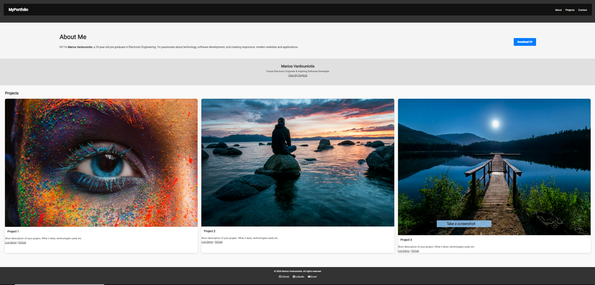

# My Portfolio

 A responsive portfolio website to showcase my web development projects.

---

 # Overview

This project was built as part of my learning path toward becoming a full stack web developer.  
It demonstrates skills in HTML, CSS (Flexbox/Grid), and responsive design.

---

 # Features

- ✅ Fully responsive layout
- ✅ Flexbox and CSS Grid usage
- ✅ Sticky/fixed navigation bar
- ✅ Smooth section scroll (if JS is used)
- ✅ Mobile-first design

---

# Technologies Used

- HTML5
- CSS3 (Flexbox, Grid)
- (Optional) JavaScript
- (Optional) [Framework: React / Bootstrap / Tailwind]

---

 # Demo / Screenshot



*(Upload an image of your project in the root folder as `screenshot.png`)*

---

 # Live Demo

[Click here to view it live] (https://mariosvardou.github.io/my-portfolio/)


# In this project I practiced:
- Structuring web pages with semantic HTML
- Creating flexible layouts using Flexbox/Grid
- Handling positioning: `relative`, `absolute`, `fixed`
- Designing for multiple screen sizes (media queries)

---


 Clone the repository:
 ```bash git clone https://github.com/your-username/project-name.git  ```bash

# Vardouniotis Marios  – [LinkedIn](https://linkedin.com/in/mariosvardou) | [GitHub](https://github.com/mariosvardou)

 # This project is open source and available under the [MIT License](LICENSE).


     
